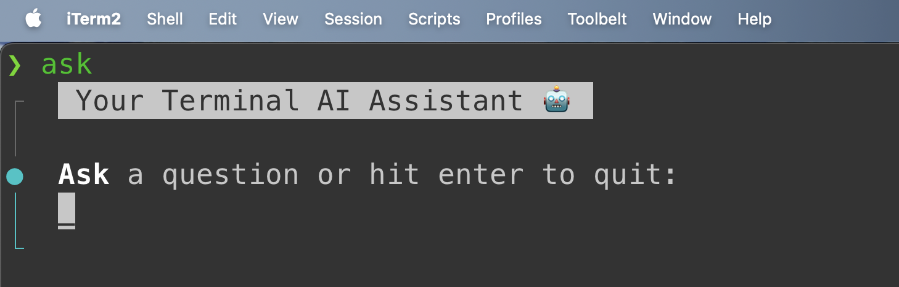

# General
A custom CLI AI assistant made in Node.js with the OpenAI API.

## Installation & Usage
1. Create an [OpenAI account](https://platform.openai.com/signup) or [sign in](https://platform.openai.com/login).
2. Navigate to the [API key page](https://platform.openai.com/account/api-keys) and "Create new secret key".
3. Create an .env file in the root directory:
    ```bash
    cp .env.example .env
    ```
4. Add your OpenAI API key to the .env file. Review/change other settings as needed.

5. Install dependencies and run the CLI:
    ```bash
    npm install
    ```

    To use the CLI:
    ```bash
    node index.js
    ```

6. To install and use the CLI globally:
    ```bash
    npm install -g .
    # or
    sudo npm install -g .
    ```

    Then run the tool in your terminal from anywhere with the `ask` command.    
    


## Chat History
Chat history is saved to the `./history` directory. Each conversation is saved in a separate file. The file name is the date and time the conversation ended.

The last text chat is automatically loaded when the CLI is started. To start a new chat, use the `--new` or `-n` flag:
```bash
ask -n
```

To clear the chat history, delete all files in the history directory.
```
ask -d
```
